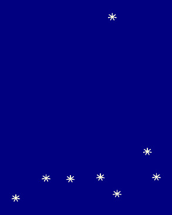

# For those about to Star (We salute you)


## Have you ever tried to draw a star?

Well, I only once, being pissed off. It's certainly nothing special, but if you want to repeat the experience it gets boring. So this is what those just few lines of Python code are for.

And then turned out that there are so many different stars.

`Eight-stars` is not plotting lib. It simply provides geometry, that can be used by such heroes as `matplotlib`, for example. Like here:
```python
from itertools import chain
from matplotlib import pyplot as plt


plt.figure(figsize=(11,1))
plt.axis('off')

stars = [] 
for i in chain(range(5), range(6,9)):
    star = Star(Point(i, 0), outer_diameter=0.8, inner_diameter=0.2, corners=6)
    stars.append(star)
`    
colors = ['hotpink', 'red', 'orange', 'yellow', 'green', 'turquoise', 'indigo', 'violet']

for star, color in zip(stars, colors):
        plt.fill(star.get_x_coordinates(), star.get_y_coordinates(), color=color)  
```

## And then came the US presidential election

Isn't that a good time to draw another 50 stars? Of proper size in a right place, according to [design specifications and colors](https://en.wikipedia.org/wiki/Flag_of_the_United_States#Design):


```python
from matplotlib import pyplot as plt
import matplotlib.patches as patches

from eightstars.geometry import Star, Point

A = 1.0
B = 1.9
C = A * 7/13
D = B * 2/5
E = F = C/10
G = H = D/12
L = A/13
K = L * 4/5

scale = 8
fig, ax = plt.subplots(1, figsize=(B*scale, A*scale), edgecolor="green")

rect = patches.Rectangle((0, 0), B, A, facecolor='#FFFFFF')
ax.add_patch(rect)

# Strips
for i in range(0, round(A/L), 2):
    rect = patches.Rectangle((0, A - i*L - L), B, L, facecolor='#B22234')
    ax.add_patch(rect)

# Stars
rect = patches.Rectangle((0, A-C), D, C, facecolor='#3C3B6E')
ax.add_patch(rect)

stars = []
for i in range(6*5):
    row = i//6
    col = i % 6
    star = Star(Point(G+col*2*H, A-E-row*2*F), K)
    stars.append(star)

for i in range(5*4):
    row = i//5
    col = i % 5
    star = Star(Point(G+H+col*2*H, A-E-F-row*2*F), K)
    stars.append(star)


for star in stars:
    ax.fill(star.get_x_coordinates(), star.get_y_coordinates(), color="#FFFFFF")

ax.axis('off');
```

## But what about European Union?

Of course, as the [specifications](https://en.wikipedia.org/wiki/Flag_of_Europe#Specifications) prescribe.


```python
import math

import matplotlib.patches as patches
from matplotlib import pyplot as plt

from eightstars.geometry import Point, Star

half_height = 1

stars = []
ring_center = Point(3/2*half_height, half_height)
ring_radius = 2/3 * half_height
star_diameter = 2/9 * half_height

number_of_stars = 12
circle_center = Point(3/2 * half_height, half_height)
spacing_angle = 2 * math.pi / number_of_stars


for i in range(number_of_stars):
    star = Star(
        ring_center.moved(
            math.sin(spacing_angle*i) * ring_radius,
            math.cos(spacing_angle*i) * ring_radius
        ), star_diameter)
    stars.append(star)


fig, ax = plt.subplots(1, figsize=(15, 10))

rect = patches.Rectangle((0, 0), 3*half_height, 2 *
                         half_height, linewidth=1, facecolor='#003399')
ax.add_patch(rect)

for star in stars:
    ax.fill(star.get_x_coordinates(), star.get_y_coordinates(), color="#FFCC00")

ax.axis('off');
```

## Or maybe some real contellations of "Big Dipper" and Polaris?



```python
from matplotlib import pyplot as plt

from eightstars.geometry import Point, Star

# Get image coordinates from any picture of Ursa Major and the North Star
X = [95, 202, 288, 394, 453, 592, 560, 436]
Y = [810, 728, 731, 724, 792, 723, 619, 66]

# Change image coordinates (top-left) to plot coordinates (bottom-left)
mi = min(Y)
ma = max(Y)
Y = [mi + (ma - y) for y in Y]

plt.figure(figsize=(5, 6.5), facecolor="navy")

for x, y in zip(X, Y):
    star = Star(Point(x, y), outer_diameter=30, inner_diameter=2, corners=7)
    plt.fill(star.get_x_coordinates(),
             star.get_y_coordinates(), color='lightyellow')

plt.axis('off');
```

# HOW TO

Just create object from `eightstars.geometry.Star` class passing few arguments.

| param | description |
| ----- | ----------- |
| `center` | An `eingtstars.geometry.Point` object designating center of a star. The constructor requires two standard `x` and `y` coordinates. |
| `outer_diameter` | Double distance from center of the star to its corners (outer vertices). Why not radius? Well, there are so many specification of stars' usage refering to diameters. See specs of US, EU, Australia or China flags, for examples. |
| `first_corner_slope` | First corner slope by default is equal 0 radians, so pointing to the top (or north). That not always what we want. You may change it to anything between [0, 2π) |
| `corners` | Number of star corners |
| `style` | One of two (the default) ways of forming the star. In this case inner vertices of a star can are depicted by intersections of straights passing by its corners. If straights are going from corner `n` to `n+2` style is 2 (the default in default), if from `n` to `n+3` style is 3, and so on. This solution drives sometimes to some anomalies, because straights may overlap or run in parallel. In such a case it's not possible to construct a star, so you'll get an excpetion. |
| `inner_diameter` | The other way to form a star is setting its distance of inner vertices to the center (as a mater of fact the double distance - why? see `outer_diameter` description. That is how stars on Australian flag are defined. If you set `inner_diameter` of a star the `style` is skipped.|
| `decimals` | This is how float numbers calculation is going to be rounded (defaults to 5 digits after decimal point). Floating-point arithmetic is what we should always remember, and here especially important when geometry of a star is calculated according to `style`. Numbers not rounded properly may cause parallel straights to intersect somewhere far far away. |

And then get its coordinates using `star.get_x_coordinates()` and `star.get_y_coordinates()` as in examples above.If you want to collect only corners or only inner vertices get every two?


```python
# corners' x coordinates
star.get_x_coordinates()[::2]
# inner vertices' coordinates
zip(star.get_x_coordinates()[1::2], stars[0].get_y_coordinates()[1::2])
```